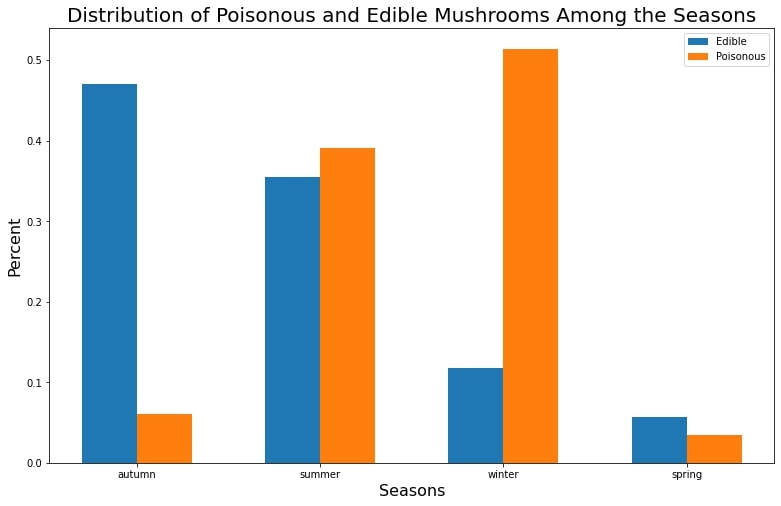
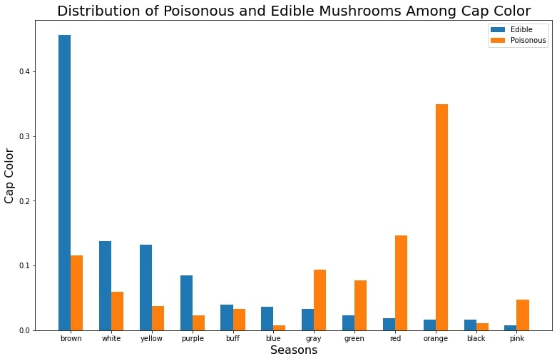

# Warning! This project was done for educational purposes as a means to demonstrate techniques used in machine learning. The following report is meant to illustrate how a README could be constructed for a shareholder. UNDER NO CIRCUMSTANCE SHOULD THIS MODEL BE USED TO CLASSIFY THE TOXICITY OF A MUSHROOM! THIS MODEL WAS BUILT USING A SYNTHETIC DATA SET. THERE IS NO REASON TO BELIEVE THE METRICS OF THIS MODEL WILL TRANSLATE TO REAL WORLD DATA!

     

# Amateur mushroom gatherers should stick to autumn for picking mushrooms and should stick with brown colored mushrooms. Avoid picking mushrooms in spring, summer, and winter, and avoid orange, red, green, and gray mushrooms.
## Data visualizations show the safest season for picking mushrooms, and which colors tend to be the most likely to be toxic.

**Michael Vincent**: 

### Business problem:

Data was analyzed to see if the toxicity of a mushroom could be predicted using various aspects of mushrooms.

### Data:
The data can be downloaded [here.](https://archive.ics.uci.edu/ml/datasets/Secondary+Mushroom+Dataset)
There are 60923 data points with 21 attributes  including dimensions, colors, and shapes of the mushrooms.

## Methods:
- Duplicate values removed.
- Attributes with more than 60% of their data points missing were removed.
- The remaining missing values were imputed with a label to indicate missing data
- Visualizations were constructed to find comparisons between poisonous and edible mushrooms.
- Quantitative data was checked for correlations
- Quantitative data was scaled for modeling.
- Categorical data was encoded using one hot encoding. There was no ordinal data.
- A decision tree, logistic regression, bagged tree, and random forest models were constructed.
- Principal component analysis was considered as a means to boost performance.
- Models were evaluated using accuracy, precision, and recall.

## Results:

#### Toxicity By Season

> Autumn is the safest season to gather mushrooms. Winter is the worst season for toxic mushrooms

#### Toxicity by color

> Edible mushrooms tend to be brown. Orange and red mushrooms in particular tend to be poisounous.

## Model:

We used a decision tree without PCA as our final model. The PCA had a minimal effect on model performance, and caused the model to lose a small amount of accuracy, precision, and recall, so we chose to not use PCA. The decision tree had perfect accuracy, recall, and precision on both the test and training data. The bagged tree and random forest also had perfect metrics, but did not make predictions as rapidly as the decision tree.

## Recommendations:

Amateur mushroom gatherers should only gather mushrooms in autumn, and should only gather brown mushrooms. 

## Limitations & Next Steps:

We are concerned that our perfect evaluation scores will cause people to be overconfident in this model. No machine learning model is 100% accurate, and we cannot guarantee this model will accurately predict the toxicity of every mushroom. We recommend that mushroom gatherers consult an expert before consuming any mushrooms gathered with the aid of this model.

### For further information:

For any additional questions, please contact **michael.vincent@employer.com**

